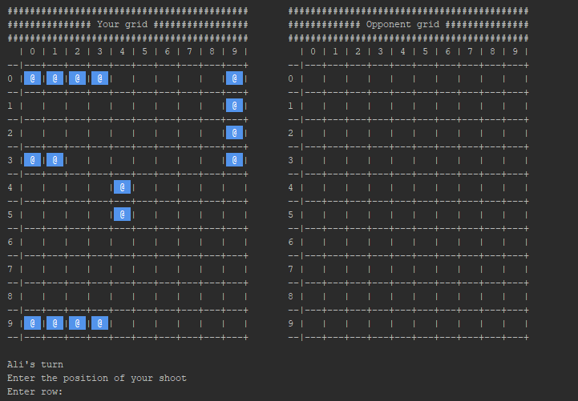
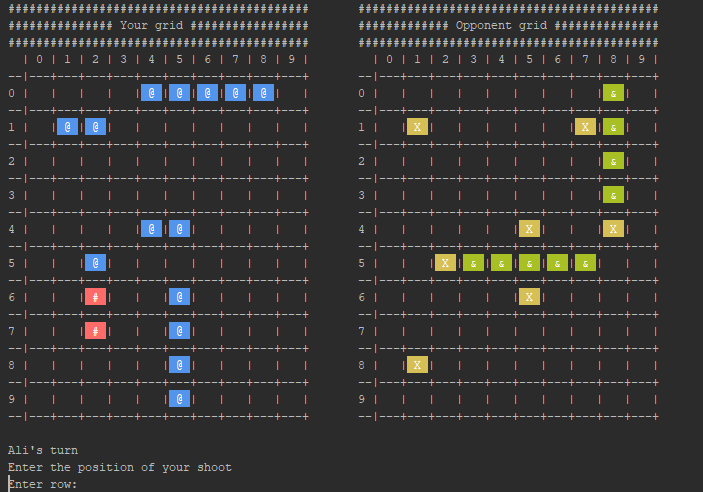

# Battleship Game
In this mini project, I implement Battleship game in non graphical environment(console).
Although it's not a hard project, it's a good project for learning OOP concepts.
You can see rules of the game at link below:

[Battleship game](https://en.wikipedia.org/wiki/Battleship_(game))

## Output
You can see the out below:

